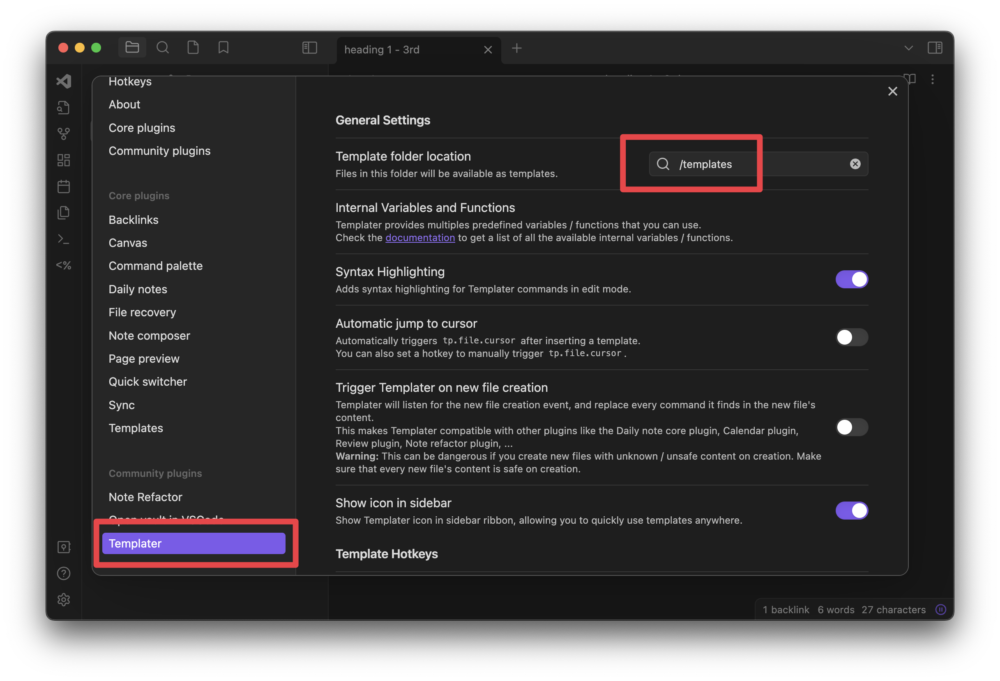
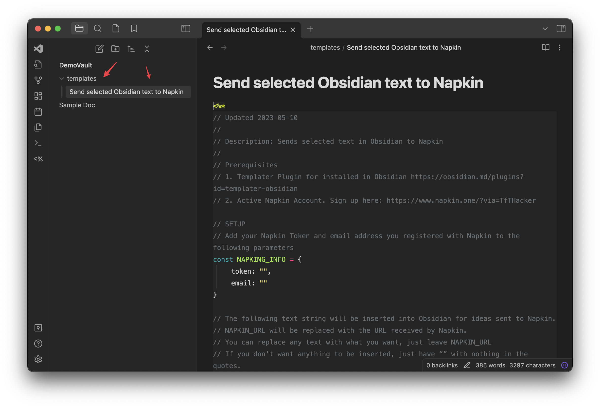
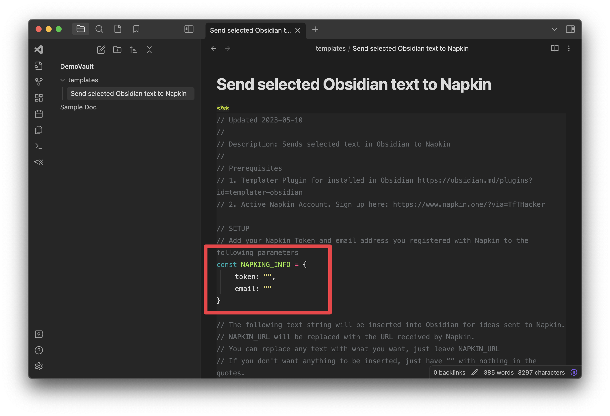
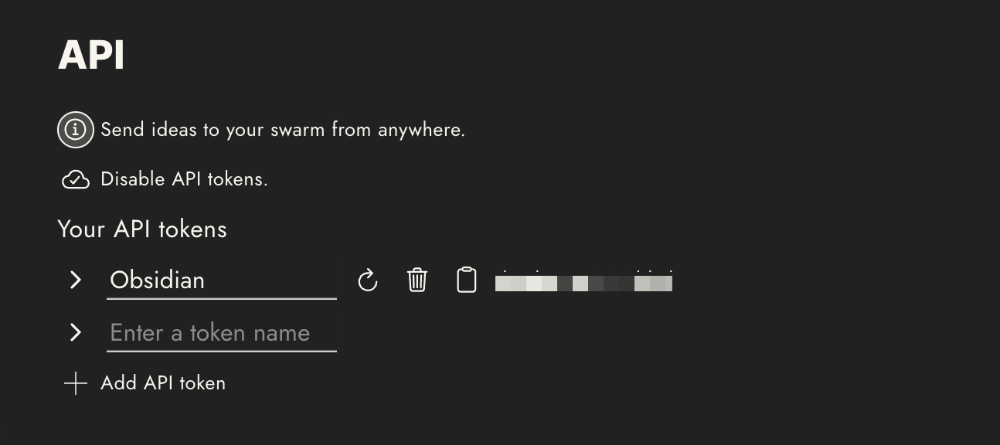
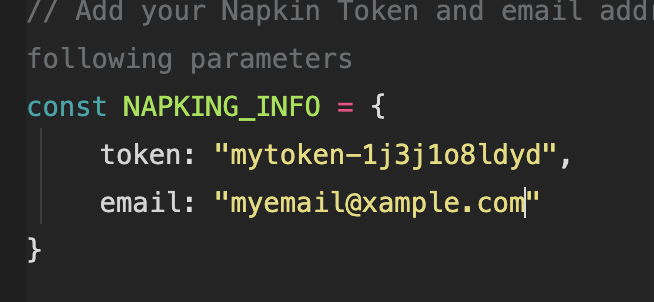
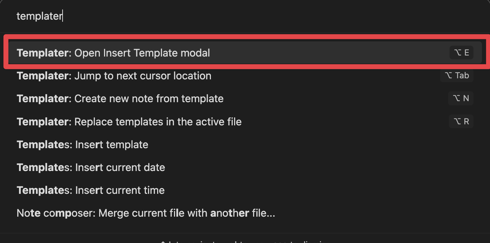
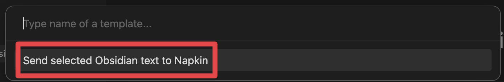

# Obsidian to Napkin Toolbox
This repository contains tools to help send notes (thoughts and ideas) from an [Obsidian](https://obsidian.md) vault to [Napkin](https://www.napkin.one).

These tools help us to leverage the best of both of these tools. Obsidian is an amazing long-form note-taking tool, while Napkin helps us in a unique visual way to be inspired and more creative by leveraging the ideas we capture in our life.

## Watch this tool in action!
Click the image to view it on YouTube:

## Support my work
If you like my work and would like to help support it, please consider signing up for a Medium membership using my referral link: [https://bit.ly/o42-medium](https://bit.ly/o42-medium) or buy me a coffee at: [https://bit.ly/o42-kofi](https://bit.ly/o42-kofi).

# Prerequisites
1. Templater Plugin installed in Obsidian. It is available from this [link](https://obsidian.md/plugins?id=templater-obsidian).
	- We assume you have some basic knowledge of using Templater.
2. An active Napkin account. Sign up for Napkin at this [link](https://www.napkin.one/?via=TfTHacker) if you do not have an account.

# Installation
**Summary**
This looks harder than it is. Just follow the steps closely and it will be ready to go quickly.

**Time needed**
5 to 10 minutes

**Overview** 
The **Templater Scripts** folder of his repository contains example Templater scripts for sending notes from Obsidian to Napkin. These installation instructions will explain the _Send selected Obsidian text to Napkin.md_, however as we add other scripts in the future to this repository, the installation concepts of these instructions will also apply to them as well.

## Step 1 - Confirm Templater Plugin  Setup
* Confirm that the [Templater Plugin](https://obsidian.md/plugins?id=templater-obsidian) is installed in Obsidian.
* Confirm that a templates folder is defined in the Templater plugin settings, as shown in the following image:

**Explanation**:
Templater looks for templates in this folder defined in the plugin settings. You can have many templates in this folder.

# Step 2 - Add the Template
- Copy the file **Send selected Obsidian text to Napkin.md** file from this repository **Templater Scripts** folder to the Templates folder as defined in the previous step. It will look something like this in Obsidian after you complete this step:

# Step 3 - Napkin User Credentials
- Next, we need to modify the template file that you copied in Step 2 so that it has your Napkin user credentials. Without this information, the script cannot send information to your Napkin database.
- In the script, near the beginning you will see this text:

- We need two pieces of information. Your Napkin token and your Napkin email address. This can be found in your profile in Napkin. The token is under the API section. You need to create a new API token. It will look something like this:

- Once you get this information from your Napkin profile, in the template file add your Napkin credentials into the script's variables, in between the quotes. 
	- Don't worry if you are not a programmer, just make sure your information is typed in between the quotes and will look something like this:

> NOTE: The token from Napkin gives the script secure access to your notes. You should never share this token with others. 

# Step 4 - Using the Script
Now that Templater and the template script is all set up, you can use the script to send your ideas from Obsidian to Napkin.

**To do this**:
* First, _select some text in an Obsidian note_. Make sure Obsidian is in edit mode for the note, as this script does not work with documents in Preview mode.
	* After selecting the text, pull up the command palette in Obsidian (CTRL/CMD+P) and select "_Templater: Open Insert Template modal_" 
		
* This will then open up a list of templates to run. Select the script we just installed:

That is it! This will send the selected text to Napkin. 

Just repeat this step each time you want to send a new thought to Napkin.

This completes the installation of the script. If you run into problems, please start a discussion on this repository and we will help you resolve the problem.

# Contribute to this Repository
If you develop your own Templater scripts for "Obsidian to Napkin", please consider sharing them with the community in this repository.
